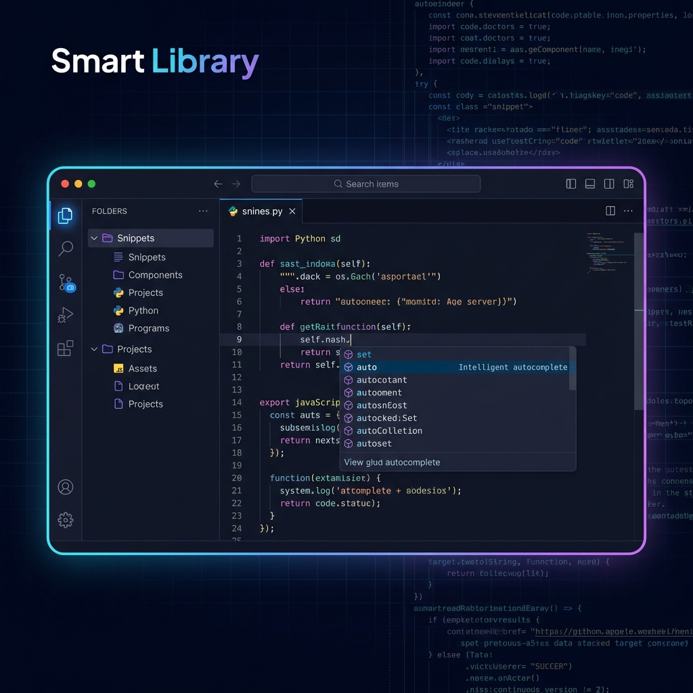

# Smart Code Library



## Overview
**Smart Code Library** is a sleek, premium, and privacy-focused single-file web application designed to help you organize and manage your code snippets with maximum efficiency.

## 🚀 Key Benefits

*   **Zero-Setup Productivity**: A single-file HTML solution that runs directly in your browser. No databases to configure, no servers to maintain.
*   **Privacy by Design**: Your code stays with you. All data is saved exclusively in your browser's Local Storage, ensuring total privacy and offline access.
*   **Pro-Grade Editor**: Integrated with the **Monaco Editor** (the same engine behind VS Code) for high-performance syntax highlighting and intelligent code editing.
*   **Instant Organization**: Powerful filtering by language, type, and tags, combined with real-time search, helps you find the right snippet in seconds.
*   **Bilingual & Documented**: Fully localized in English and Spanish, featuring a built-in interactive manual to get you started immediately.


## Deployment to GitHub Pages

To deploy this application to GitHub Pages:

1.  **Create a Repository:** Create a new repository on GitHub.
2.  **Push Code:** Push the contents of this folder to the repository.
    ```bash
    git init
    git add .
    git commit -m "Initial commit"
    git branch -M main
    git remote add origin <YOUR_REPO_URL>
    git push -u origin main
    ```
3.  **Configure Pages:**
    *   Go to your repository **Settings**.
    *   Navigate to the **Pages** section (on the left sidebar).
    *   Under **Build and deployment** > **Source**, select **Deploy from a branch**.
    *   Under **Branch**, select `main` and `/ (root)`.
    *   Click **Save**.

Your app will be live at `https://<USERNAME>.github.io/<REPO_NAME>/`.

## Google Analytics Configuration

Google Analytics tracking has been integrated for:
*   Application Load (Page View)
*   Snippet Uploads (Add to Library)

The Google Analytics Measurement ID has been configured in `index.html`.

## Privacy

**Your Data is Yours.**
Smart Code Library stores all your snippets, collections, and configurations exclusively in your browser's **Local Storage (LocalStorage)**.
*   There are no backend servers.
*   There are no cloud databases.
*   The application only reads and organizes the information you save locally.
*   The only data sent externally is anonymous usage analytics to Google Analytics.

## License

This project is licensed under the **MIT License** - see the [LICENSE](LICENSE) file for details.

**© 2026 BIOSZEN. All Rights Reserved.**
While the source code is open-source under MIT, the "SmartLib SZ" brand, logo, and active deployment are proprietary assets of the author.
